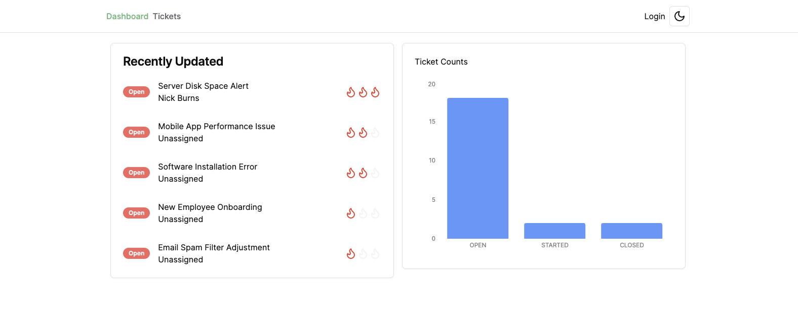
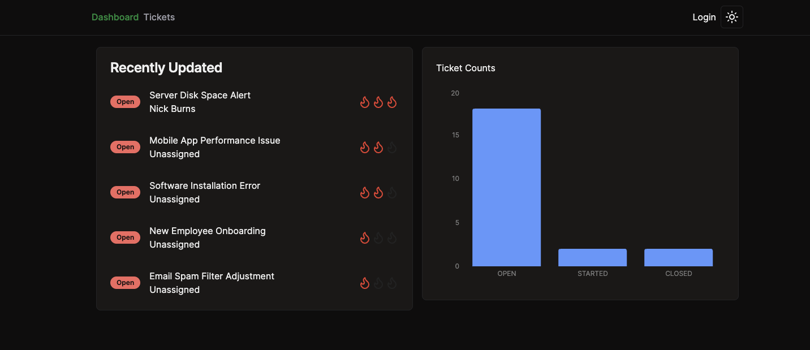
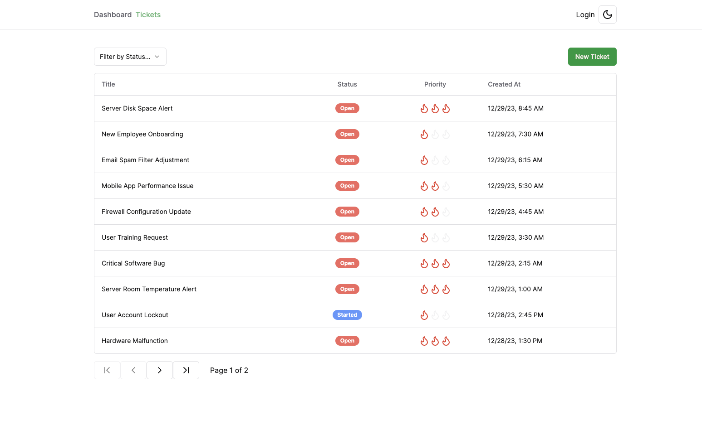
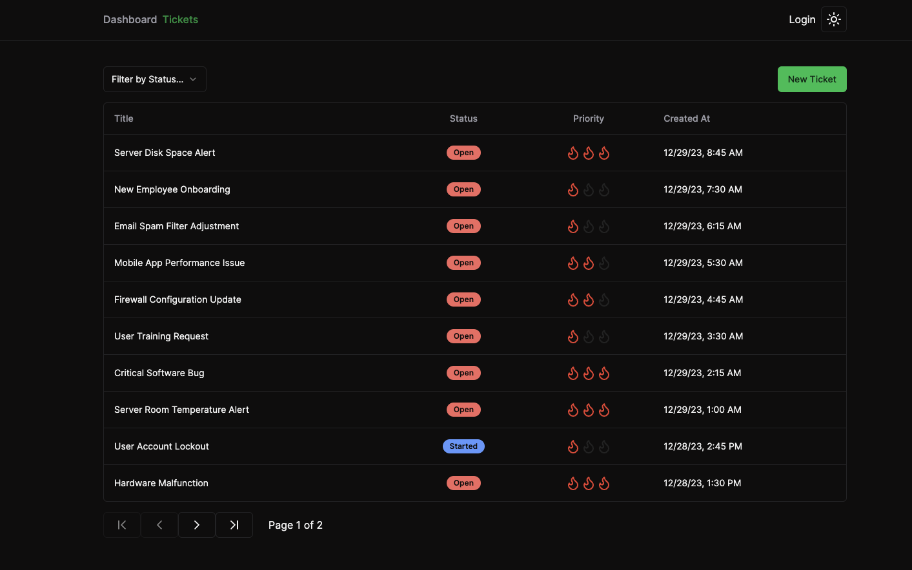

# Ticket App

A simple IT Ticketing application written in NextJS/TypeScript.

---

## Home page

### Light Mode

### Dark Mode

---

## Tickets

### Light Mode

### Dark Mode

---

## Features

- Light/Dark Mode toggle
- Graphs with Rechart
- UI Components with Shadcn
- User Authentication with NextAuth

---

## Tech Stack

- NextJS/TypeScript
- Shadcn
- Prisma & Postgres 
- Icons with Lucide React
- TailwindCSS for styling

---

## TODOS

- `[ISSUE]` -> fix issue with last user assigned still showing up as assigned in the Assign Ticket field.
- `[DOCS]` -> Add documentation and detailed walk-through of the app.
- `[CICD]` -> Dockerize the app
- `[AUTH]` -> Add Google Provider Support support
- `[AUTH]` -> Add Github Provider Support support
- `[AUTH]` -> Add Microsoft Provider Support support

---

## Dependencies

- [Axios](https://axios-http.com/docs/intro) - HTTP Requests
- [Lucid React](https://lucide.dev/guide/packages/lucide-react) - Icons
- [NextJS/TypeScript](https://nextjs.org/) - App framework
- [NextAuth](https://next-auth.js.org/) - Authentication
- [React Hook Form](https://www.react-hook-form.com/) - Forms
  - [Hookform Resolvers](https://www.npmjs.com/package/@hookform/resolvers) - enables using zod for validation of form data.
    - [Resolver documentation](https://react-hook-form.com/docs/useform#resolver)
- [React Markdown](https://www.npmjs.com/package/react-markdown) - Viewing Markdown
- [React SimpleMDE (EasyMDE) Markdown Editor](https://www.npmjs.com/package/react-simplemde-editor)
  - [EasyMDE Markdown Editor](https://www.npmjs.com/package/easymde)
- [Recharts](https://recharts.org/en-US/) - Charts
- [Shadcn/ui](https://ui.shadcn.com/) - Components
  - [Alert Dialog](https://ui.shadcn.com/docs/components/alert-dialog) 
  - [Badge](https://ui.shadcn.com/docs/components/badge)
  - [Button](https://ui.shadcn.com/docs/components/button)
  - [Card](https://ui.shadcn.com/docs/components/card)
  - [Data Table](https://ui.shadcn.com/docs/components/data-table)
  - [Form](https://ui.shadcn.com/docs/components/form)
  - [Input](https://ui.shadcn.com/docs/components/input) 
  - [Select](https://ui.shadcn.com/docs/components/select)
- [TailwindCSS](https://tailwindcss.com/) - Styles
- [Zod](https://zod.dev/) - Schema validation

